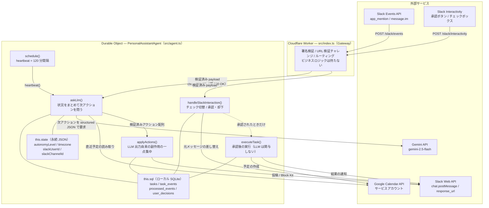
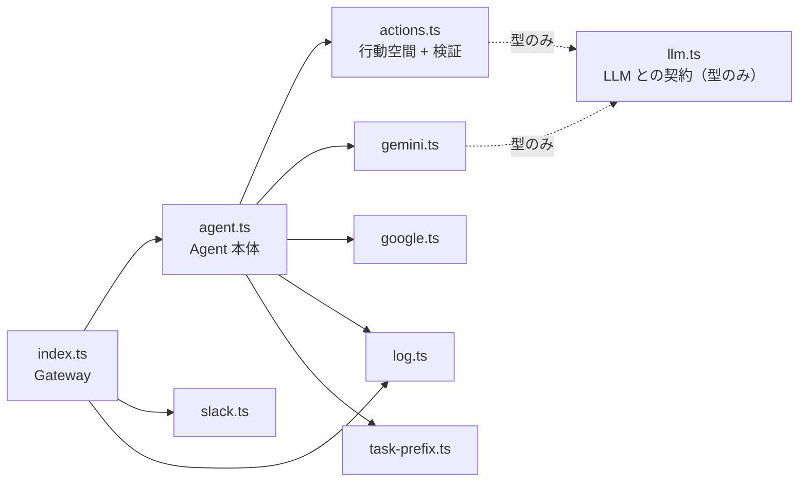
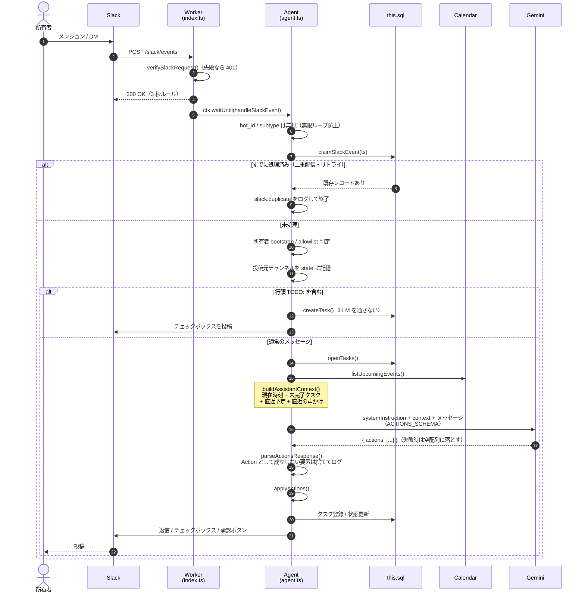
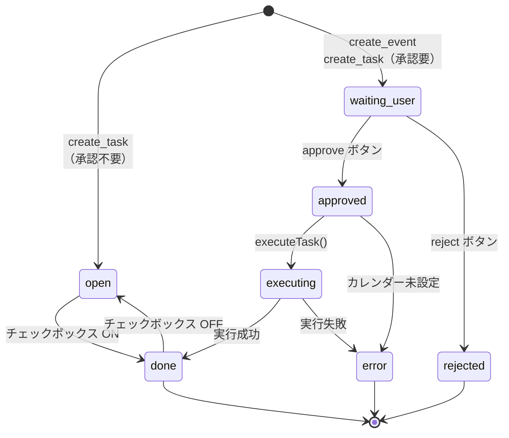

# minimal-ai-agent の基本構成

Slack を入口とする個人アシスタント Agent。Cloudflare の Durable Object 上に「1 ユーザー = 1 Agent インスタンス」を置き、
状態・タスク台帳・スケジュールをすべてその中に閉じ込めている。中央 DB も cron 用の別 Worker も置かない。
インスタンスは待機中に退避されるが、名前が同じなら常に同じ状態と台帳に戻ってくる。

このドキュメントは**構造を図で示すこと**だけを扱う。
設計上の判断の理由は [CONCEPT.md](./CONCEPT.md)、動かし方は [README.md](./README.md) を参照。

---

## 1. システム全体構成

インスタンス名は固定の `"ai-agent"`（`src/index.ts` の `AGENT_NAME`）。個人利用なので 1 つしか作らない。

**Worker はゲートウェイに徹する。** Slack の 3 秒ルールに対しては即 `200 OK` を返し、
実処理は `ctx.waitUntil()` で背後に逃がす。Agent の取得（Durable Object の起動）すらレスポンスの手前で待たない。

---

## 2. モジュール依存グラフ

一方向で循環はない。点線は `import type` だけの依存で、実行時には消える。
したがって**実行時の import グラフは 2 階層**で、`actions.ts` / `gemini.ts` / `google.ts` / `slack.ts` /
`log.ts` / `task-prefix.ts` はいずれも実行時 import を持たないリーフである。

`llm.ts` は「LLM アダプタが満たすべき契約」を型だけで書いたファイル。ここを分けてあるので、
行動空間を定義する `actions.ts` が特定のベンダ（Gemini）に依存しない。モデルを差し替える作業は、
`Generate` を満たすファイルを 1 つ書き、`agent.ts` の import 元を変えるだけになる。

外部サービスとの境界がそれぞれ 1 ファイルに閉じているのは同じで、LLM もカレンダーも Slack も
そのファイルだけで差し替えられる。

### ファイルと役割

| ファイル | 行数 | 役割 |
|---|---:|---|
| `src/index.ts` | 105 | Worker ゲートウェイ。Slack 署名検証と URL ルーティングのみ |
| `src/agent.ts` | 982 | Agent 本体。状態 / 台帳 / heartbeat / applyActions / Block Kit |
| `src/actions.ts` | 203 | 行動空間。`Action` 型・`ACTIONS_SCHEMA`・LLM 出力の検証（純関数）|
| `src/llm.ts` | 43 | LLM との契約（型のみ）。スキーマ型と `Generate` |
| `src/gemini.ts` | 61 | `Generate` の実装。`responseSchema` で JSON を強制し検証済みの値を返す |
| `src/google.ts` | 214 | Google Calendar。サービスアカウント JWT を Web Crypto で自前署名 |
| `src/slack.ts` | 66 | Slack 署名検証（HMAC-SHA256 / 5 分リプレイ窓 / fail-closed）|
| `src/log.ts` | 69 | `error` / `info` / `verbose` の 3 段ロガー（`area.event` 命名）|
| `src/task-prefix.ts` | 41 | 行頭 `TODO:` を LLM を通さず直接パースする純関数 |
| `test/*.test.ts` | 491 | `node --test` で走る純関数のテスト（`actions` / `slack` / `task-prefix` / `gemini`）|

ランタイムは Cloudflare Workers（`nodejs_compat`）、依存は `agents` SDK ただ 1 つ。
Gemini / Google Calendar / Slack はすべて `fetch` と `crypto.subtle` で手書きしてある。

---

## 3. フロー A — Slack から話しかけられたとき

主要な入口は `handleSlackEvent()`（`agent.ts:430`）→ `askLlmForSlackReply()`（`agent.ts:936`）
→ `askLlm()`（`agent.ts:955`）→ `applyActions()`（`agent.ts:541`）。

**これは ReAct 的な多段ツールループではない。**
1 トリガーにつき LLM 呼び出しは 1 回だけで、返ってきた**アクション配列をコードが順に実行**する。
ループに相当するのは (a) `applyActions()` の for ループ と (b) `heartbeat()` の時間的ループ の 2 つで、
長時間かかる作業は Slack のボタンのコールバックから再開する。

`applyActions()` は **LLM の出力に由来する副作用が起きる唯一の場所**であり、フロー A（Slack への応答）と
フロー B（heartbeat）はどちらもここに合流する。`buildAssistantContext()`（`agent.ts:819`）は
LLM の視界を一元化する唯一の場所である。どちらも「経路ごとに振る舞いがズレる」のを構造的に防ぐために 1 つにまとめてある。

副作用の出口はこれで全部ではない。ボタン押下から始まる経路——チェックの切り替え（`handleTaskToggle()`、
`agent.ts:640`）と承認後の実行（`executeTask()`、`agent.ts:768`）——は `applyActions()` を通らない。
分けてあるのは意図的で、この経路には LLM が関与しないため、通す必要がないからである
（実行内容は `payload_json` に保存済み）。**LLM の出力が通る道は 1 本、人間の操作が通る道は別の 1 本**、
と読むのが正しい。

その手前に検証がもう 1 段ある。`responseSchema` は `oneOf` を持たないため各要素の `required` は
`["type"]` だけしか書けず、`{"type":"reply"}` のように**スキーマには適合するが `Action` として
成立していない**出力があり得る。`parseActionsResponse()`（`actions.ts:186`）がそれを 1 件ずつ確認し、
通らなかった要素だけを捨てて `llm.actions.invalid` に残す。1 件の欠落で正常な返信まで失わないように、
全体を捨てるのではなく要素単位で落とす。

---

## 4. タスクの状態機械

`tasks.status` がそのまま状態機械になっている（`agent.ts:126` のスキーマ定義）。

外部作用を持つ `create_event` は `open` を経由せず、最初から `waiting_user` で登録される。
逆に `open` から `waiting_user` へ戻る経路は無い。承認の要否はタスクを作る時点で決まり、
あとから承認待ちに変える手段は用意していない。

承認/却下はどちらも `user_decisions` に記録し、`response_url` で元メッセージをボタンごと結果テキストに置き換える
（二度押しを構造的に防ぐ）。実行対象は `payload_json` に保存したアクションそのもので、
この経路に LLM は一切関与しない。

`approved` は終端になり得る。`executeTask()` は `payload_json` が `create_event` でなければ
そこで戻るので、外部作用を持たないタスク（承認付きの `create_task`）は `approved` のまま台帳に残る。
また、カレンダー未設定のときは `executing` を経ずに `approved` から直接 `error` になる（`agent.ts:785`）。

---

## 5. アクション語彙（5 種）

LLM が取れる行動はこの 5 つだけ。**スキーマ設計 = エージェントの行動空間の設計**である。

| アクション | 意味 | 副作用 | 承認 |
|---|---|---|---|
| `reply` | 質問への回答・情報提供 | Slack 投稿 | 不要 |
| `ask_user` | ユーザーに確認・判断を求める | Slack 投稿 | 不要 |
| `create_task` | タスクを台帳に登録 | SQLite INSERT | `requires_user_approval` 次第 |
| `show_task` | 既存タスクをチェックボックスで再掲 | Slack 投稿 | 不要 |
| `create_event` | カレンダーに予定を作成 | **Google Calendar 書き込み** | **必須** |

同じ語彙が 4 箇所に現れる。**能力を足すときはこの 4 つを揃えて増やす。**
うち 3 つは `src/actions.ts` に集めてある。ただし並べて置いてもズレは消えない
（型は `message` 必須なのにスキーマは `required: ["type"]` だけ）。
表現できることが違うからで、それを埋めるのが 3 つ目の「検証」である。

| 定義 | 場所 | 役割 |
|---|---|---|
| TypeScript union | `type Action`（`actions.ts:30`）| コード側の型 |
| Gemini スキーマ | `ACTIONS_SCHEMA`（`actions.ts:66`）| LLM 出力の強制 |
| 検証 | `toAction()`（`actions.ts:132`）| スキーマで縛れない必須項目の確認 |
| ディスパッチ | `applyActions()`（`agent.ts:541`）| 実際の副作用 |

union 型ではなく「`type` フィールドで分岐する 1 種類のオブジェクト」に寄せているのは、
Gemini の `responseSchema` が OpenAPI サブセットで `oneOf` を持たないため。
その代償が「どのフィールドも省略され得る」ことなので、`toAction()` が埋めている。

`toAction()` は承認後の実行経路でも使う。`executeTask()`（`agent.ts:768`）は `payload_json` から
アクションを読み戻してカレンダーに書き込むが、そこには過去のバージョンが書いた行も混じり得るため、
外部作用の直前でもう一度同じ関門を通す。

### heartbeat（フロー B）が何を見て動くか

同じ `askLlm()` を通るが、渡す問いが違う。`askLlmForPlan()` は**点検リスト**を渡す
（期限超過 → 24 時間以内の期限 → 止まっている承認 → 着手されていないタスク →
予定に関連する未完了タスク）。
「価値があれば言え」と頼むと、判断基準が LLM 側に無いため黙る方に倒れ続けるので、
該当・非該当が決まる形にしてある。

そのための材料が `buildAssistantContext()` に 2 つ増えている。**現在時刻**（ユーザーの
タイムゾーン。これが無いと期限の判定自体ができない）と、**直近 24 時間の声かけ**
（`task_events` の `nudged`。`tasks.updated_at` は台帳の変更でしか動かないので、
催促した事実はここに残す）。タスク側も `created_at` / `updated_at` を渡すようにしてある。

静音は LLM に判断させない。`isQuietHours()`（22:00〜07:00）が真で期限超過タスクが
無ければ、`heartbeat()` は LLM を呼ばずに `heartbeat.quiet` を残して終わる。時刻から機械的に
決まることをプロンプトに委ねる理由がなく、API も消費しない。

発言の中身も 1 段だけコードで縛ってある。`withoutEmptyTalk()`（`agent.ts:272`）が
`show_task` を伴わない `reply` / `ask_user` を落とし、`heartbeat.empty_talk` に残す。
点検リストの候補はどれもタスク起点なので、タスクの無い発言は「10:00 に予定があります」の類
（コンテキストの読み上げ）にしかならない。**プロンプトは依頼、コードは保証**という切り分けで、
プロンプト側にも同じ規則と却下例を書いてある。

ボタン押下側にもう 1 つディスパッチ表がある。`handleSlackInteraction()`（`agent.ts:712`）が
`action_id` で分岐し、`task_toggle` はチェックボックス、`approve` / `reject` は承認ゲートに向かう。
違いは**外部作用を伴うかどうか**だけで、伴わないチェックには承認は要らない。

---

## 6. 状態の 3 層

| 置き場所 | 寿命 | 内容 |
|---|---|---|
| `this.state`（永続 JSON）| Agent と同じ | `autonomyLevel`（既定 `suggest`）/ `timezone` / `slackUserId` / `slackChannelId` |
| `this.sql`（ローカル SQLite）| Agent と同じ | `tasks` / `task_events` / `processed_events` / `user_decisions` |
| モジュール変数 | isolate の生存中のみ | Google アクセストークンの短期キャッシュ（`google.ts`）|

テーブルは `onStart()`（`agent.ts:118`）で冪等に作る。`onStart()` はコードやシークレットの更新で
Durable Object が作り直されるたびに走るため、heartbeat の予約も「登録済みか」を確認してから行う。

### 主な定数

| 定数 | 値 | 場所 |
|---|---|---|
| `HEARTBEAT_INTERVAL_MIN` | 120（分）| `agent.ts:42` |
| `PROCESSED_EVENT_KEEP` | 200（件）| `agent.ts:45` |
| `DEFAULT_MODEL` | `gemini-2.5-flash` | `gemini.ts:11` |
| `FIVE_MINUTES`（リプレイ許容窓）| 5 分 | `slack.ts:9` |
| `MAX_TASKS_PER_MESSAGE` | 10 | `task-prefix.ts:14` |
